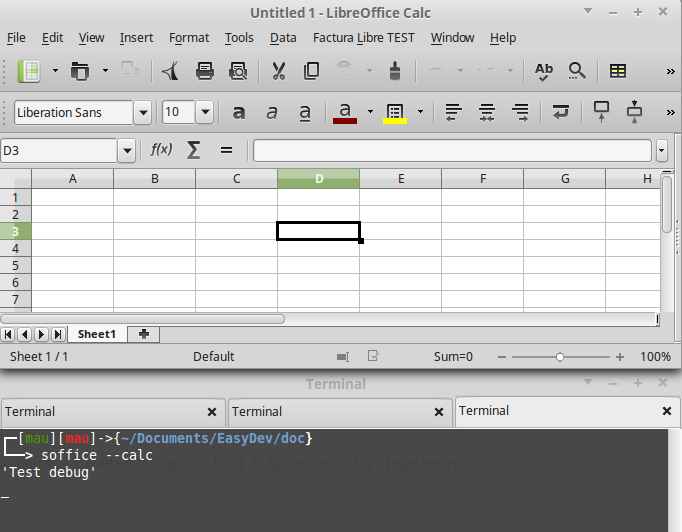

Herramientas para depuración
============================

Mostrar información en shell
----------------------------

Solo Linux

.. code-block:: vbnet

    Sub Debug()
        'Crear servicio
        util = createUnoService("org.universolibre.EasyDev")

        util.debug("Prueba de depuración")
    End Sub

En Windows, puedes abrir y guardar un nuevo documento con el nombre **debug.odt**
y mostrar la información de depuración en este documento.

.. image:: images/img003.png
    :width: 500px
    :align: center

Guardar información en un archivo
---------------------------------

.. code-block:: vbnet

    Sub LogFile()

        util = createUnoService("org.universolibre.EasyDev")

        util.log("/home/USER/log.txt", util)

    End Sub

Automáticamente se agrega la fecha y hora. ::

    2015-10-28 20:56:35 - EasyDev - <uno_component.EasyDev object at 0x7f96caf34438>
    2015-10-28 20:56:41 - EasyDev - <uno_component.EasyDev object at 0x7f96caf34438>

msgbox Especial
---------------

Mostrar cualquier información en un cuadro de mensaje como objectos y matrices.

.. code-block:: vbnet

    Sub MessageBox()
        util = createUnoService("org.universolibre.EasyDev")

        util.msgbox("Información de depuración")

        'Mostrar cualquier dato
        data = "Como texto"
        util.msgbox(data)

        'Números'
        data = 12345
        util.msgbox(data)

        'Matrices'
        data = Array("Uno", 2)
        util.msgbox(data)

        util.msgbox(util)
    End Sub

Llamar a MRI
------------

MRI es la mejor extensión para instrospección de objetos para Apache OpenOffice
y LibreOffice. `Descargala`_ e instalala.

Llamala desde EasyDev.

.. code-block:: vbnet

    Sub CallMRI()
        util = createUnoService("org.universolibre.EasyDev")

        'MRI es una gran extensión.
        util.mri(util)
    End Sub

.. image:: images/img004.png
    :width: 500px
    :align: center

.. _Descargala: http://extensions.openoffice.org/en/project/MRI
