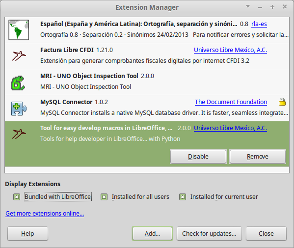

Introducción
============
EasyDev puede ayudarte a desarrollar macros en LibreOffice.

Instalación
-----------
    * Decarga la ultima versión desde `GitHub`_.
    * Abre LibreOffice
    * Menú: Herramientas -> Administración de extensiones...
    * Agregar...

Probando la herramienta
-----------------------

.. code-block:: vbnet

    Sub Prueba()
        'Creando el servicio
        util = createUnoService("org.universolibre.EasyDev")

        MsgBox util.VERSION
    End Sub

.. _GitHub: https://github.com/UniversoLibreMexicoAC/easydev/tree/master/files
